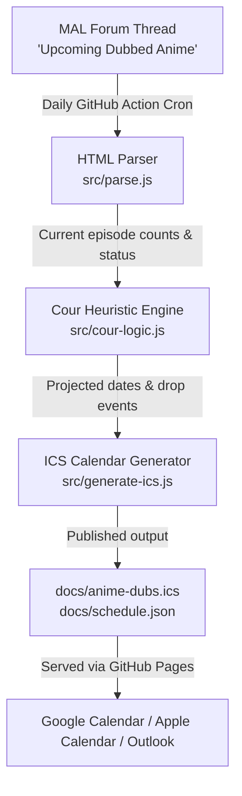

<div align="center">

# 📅 Anime Dub Calendar

**Automated, intelligent weekly English anime dub release schedule feed.**  
Syncs episode premiere dates directly to your Google Calendar, Apple Calendar, or Outlook.

[](https://github.com/fizzyfrys/anime-dub-calendar/actions/workflows/build.yml)
[](https://fizzyfrys.github.io/anime-dub-calendar/)
[](https://fizzyfrys.github.io/anime-dub-calendar/anime-dubs.ics)
[](https://github.com/fizzyfrys/anime-dub-calendar/actions)
[](LICENSE)

<br/>

### 🌟 [👉 Open Live Web App & Schedule Viewer 👈](https://fizzyfrys.github.io/anime-dub-calendar/)

<br/>

<!-- Subscription Buttons -->
<p align="center">
  <a href="https://calendar.google.com/calendar/render?cid=webcal%3A%2F%2Ffizzyfrys.github.io%2Fanime-dub-calendar%2Fanime-dubs.ics">
    
  </a>
  &nbsp;
  <a href="webcal://fizzyfrys.github.io/anime-dub-calendar/anime-dubs.ics">
    
  </a>
  &nbsp;
  <a href="https://fizzyfrys.github.io/anime-dub-calendar/anime-dubs.ics">
    
  </a>
</p>

</div>

---

## ⚡ Quick Subscription Feeds

Choose your preferred format:

### 1. 🏷️ Standard Feed (`Title - Ep ##`) — *Default*
*Ideal for desktop calendar views and clean list overviews.*
- **Google Calendar**: [📅 Add Standard Feed](https://calendar.google.com/calendar/render?cid=webcal%3A%2F%2Ffizzyfrys.github.io%2Fanime-dub-calendar%2Fanime-dubs.ics)
- **Apple Calendar / Webcal**: [🍎 Subscribe via Webcal](webcal://fizzyfrys.github.io/anime-dub-calendar/anime-dubs.ics)
- **Raw URL**: `https://fizzyfrys.github.io/anime-dub-calendar/anime-dubs.ics`

### 2. 📱 Compact Feed (`Ep ## · Title`) — *Mobile & Widget Friendly*
*Guarantees episode numbers are always visible upfront without getting truncated by long anime titles.*
- **Google Calendar**: [📅 Add Compact Feed](https://calendar.google.com/calendar/render?cid=webcal%3A%2F%2Ffizzyfrys.github.io%2Fanime-dub-calendar%2Fanime-dubs-ep-first.ics)
- **Apple Calendar / Webcal**: [🍎 Subscribe via Webcal](webcal://fizzyfrys.github.io/anime-dub-calendar/anime-dubs-ep-first.ics)
- **Raw URL**: `https://fizzyfrys.github.io/anime-dub-calendar/anime-dubs-ep-first.ics`

---

## ✨ Features

- 🔄 **Fully Automated**: Runs every morning via GitHub Actions, scraping the community-maintained MyAnimeList thread.
- 🧠 **Cour-Aware Prediction Engine**: Automatically projects upcoming episode release dates for standard 12-episode (1 cour) and 24-episode (2 cour) broadcasts.
- 📦 **Multi-Episode Drop Detection**: Detects unannounced mid-season double/multi-episode drops and schedules them on the exact drop date.
- 🎯 **Deterministic Event UIDs**: Uses RFC 5545 compliant deterministic event IDs (`mal-dub-<slug>-ep-<n>@anime-dub-cal`) so calendar clients update existing events without duplicates.
- 🧹 **Dynamic Auto-Pruning**: When a show ends or is removed from the schedule, extra projected events are automatically purged upon the next calendar poll.
- 🌐 **Zero Server Maintenance**: Pure static hosting on GitHub Pages with GitHub Actions automation.

---

## 🛠️ How It Works



---

## 📐 Cour Projection Heuristics

Anime broadcast schedules frequently list unknown totals (`??`). This pipeline uses domain-aware cour heuristics:

| Current Progress | Inferred Total | Projected Episodes | Sync Lifecycle |
|---|---|---|---|
| `8/12` (Known total) | Exact (`12`) | Episodes 9–12 on broadcast weekday | Fixed projection |
| `8/??` (Unknown, `< 12`) | **1-Cour (12 eps)** | Episodes 9–12 | Adjusts if total updates |
| `13/??` (Boundary `12–13`) | **+2 buffer** | Episodes 14–15 | Rolling window while awaiting confirmation |
| `19/??` (Between `13–24`) | **2-Cour (24 eps)** | Episodes 20–24 | Adjusts to finale when confirmed |
| `24/??` (Boundary `24–25`) | **+2 buffer** | Episodes 25–26 | Rolling window for split-cour |
| `118/???` (Long-running) | Continuous | +4 weeks rolling ahead | Ongoing weekly projection |
| `**` (*Suspended*) | Frozen | No future projections | Marked in event description |
| `++` (*Resumes Date*) | Scheduled | Projections anchor to resume date | Resume date reflected on calendar |
| **Multi-Episode Drop** | Jump `> 1` within 7 days | Extra episodes placed on drop day | Emits separate events on same date |

---

## 🚀 Setup & Subscription Guide

### Google Calendar
1. Click the **[Subscribe in Google Calendar](https://calendar.google.com/calendar/render?cid=webcal%3A%2F%2Ffizzyfrys.github.io%2Fanime-dub-calendar%2Fanime-dubs.ics)** button above.
2. When Google Calendar opens, click **Add**.
3. Google Calendar will poll for updates automatically (typically every 8–24 hours).

*Manual Method:*
1. Open [Google Calendar](https://calendar.google.com) on desktop.
2. In the left sidebar, click **+** next to **Other calendars** → **From URL**.
3. Paste: `https://fizzyfrys.github.io/anime-dub-calendar/anime-dubs.ics`
4. Click **Add calendar**.

---

### Apple Calendar (iPhone, iPad, Mac)
1. Tap/click **[Subscribe via Webcal](webcal://fizzyfrys.github.io/anime-dub-calendar/anime-dubs.ics)**.
2. Calendar will open with a prompt to subscribe.
3. Choose your refresh frequency (e.g., **Every Day**) and click **Subscribe**.

---

### Microsoft Outlook
1. Open Outlook Calendar → **Add Calendar** → **Subscribe from web**.
2. Paste: `https://fizzyfrys.github.io/anime-dub-calendar/anime-dubs.ics`
3. Enter name (e.g. `Anime Dubs`) and click **Import**.

---

## 💻 Local Development

```bash
# 1. Clone repo
git clone https://github.com/fizzyfrys/anime-dub-calendar.git
cd anime-dub-calendar

# 2. Install dependencies
npm install

# 3. Test with a local HTML snapshot
npm run build:local

# 4. Run live scraper against MyAnimeList
npm run build
```

---

## 📚 Data Source & Disclaimer

- Data is sourced from the community-maintained [MyAnimeList "Upcoming Dubbed Anime" forum topic #1692966](https://myanimelist.net/forum/?topicid=1692966).
- This project is an independent open-source utility and is not affiliated with or endorsed by MyAnimeList.
