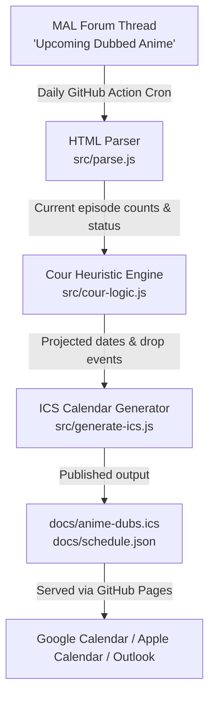

<div align="center">

# 📅 Anime Dub Calendar

**Automated, intelligent weekly English anime dub release schedule feed.**  
Syncs episode premiere dates directly to your Google Calendar, Apple Calendar, or Outlook.

[](https://github.com/fizzyfrys/anime-dub-calendar/actions/workflows/build.yml)
[](https://fizzyfrys.github.io/anime-dub-calendar/)
[](https://fizzyfrys.github.io/anime-dub-calendar/anime-dubs.ics)
[](https://github.com/fizzyfrys/anime-dub-calendar/actions)
[](LICENSE)

<br/>

### 🌟 [👉 Open Live Web App & Schedule Viewer 👈](https://fizzyfrys.github.io/anime-dub-calendar/)

<br/>

<!-- Subscription Buttons -->
<p align="center">
  <a href="https://calendar.google.com/calendar/render?cid=webcal%3A%2F%2Ffizzyfrys.github.io%2Fanime-dub-calendar%2Fanime-dubs.ics">
    
  </a>
  &nbsp;
  <a href="webcal://fizzyfrys.github.io/anime-dub-calendar/anime-dubs.ics">
    
  </a>
  &nbsp;
  <a href="https://fizzyfrys.github.io/anime-dub-calendar/anime-dubs.ics">
    
  </a>
</p>

</div>

---

## ⚡ Quick Subscription Feeds

Choose your preferred format:

### 1. 🏷️ Standard Feed (`Title - Ep ##`) — *Default*
*Ideal for desktop calendar views and clean list overviews.*
- **Google Calendar**: [📅 Add Standard Feed](https://calendar.google.com/calendar/render?cid=webcal%3A%2F%2Ffizzyfrys.github.io%2Fanime-dub-calendar%2Fanime-dubs.ics)
- **Apple Calendar / Webcal**: [🍎 Subscribe via Webcal](webcal://fizzyfrys.github.io/anime-dub-calendar/anime-dubs.ics)
- **Raw URL**: `https://fizzyfrys.github.io/anime-dub-calendar/anime-dubs.ics`

### 2. 📱 Compact Feed (`Ep ## · Title`) — *Mobile & Widget Friendly*
*Guarantees episode numbers are always visible upfront without getting truncated by long anime titles.*
- **Google Calendar**: [📅 Add Compact Feed](https://calendar.google.com/calendar/render?cid=webcal%3A%2F%2Ffizzyfrys.github.io%2Fanime-dub-calendar%2Fanime-dubs-ep-first.ics)
- **Apple Calendar / Webcal**: [🍎 Subscribe via Webcal](webcal://fizzyfrys.github.io/anime-dub-calendar/anime-dubs-ep-first.ics)
- **Raw URL**: `https://fizzyfrys.github.io/anime-dub-calendar/anime-dubs-ep-first.ics`

---

## ✨ Features

- 🔄 **Fully Automated**: Runs every morning via GitHub Actions using the MyAnimeList forum and English Dubbed calendar.
- ⏰ **Local Release Times**: Published times appear in your calendar's time zone. Dates without a published time stay all-day.
- 🧠 **Cour-Aware Prediction Engine**: Automatically projects upcoming episode release dates for standard 12-episode (1 cour) and 24-episode (2 cour) broadcasts.
- 📦 **Multi-Episode Drop Detection**: Detects unannounced mid-season double/multi-episode drops and schedules them on the exact drop date.
- 🎯 **Deterministic Event UIDs**: Uses RFC 5545 compliant deterministic event IDs (`mal-dub-<slug>-ep-<n>@anime-dub-cal`) so calendar clients update existing events without duplicates.
- 🧹 **Dynamic Auto-Pruning**: When a show ends or is removed from the schedule, extra projected events are automatically purged upon the next calendar poll.
- 🌐 **Zero Server Maintenance**: Pure static hosting on GitHub Pages with GitHub Actions automation.

---

## 🛠️ How It Works


```mermaid
graph TD
    A[MAL Forum Thread\n'Upcoming Dubbed Anime'] -->|Daily GitHub Action Cron| B[HTML Parser\nsrc/parse.js]
    B -->|Current episode counts & status| C[Cour Heuristic Engine\nsrc/cour-logic.js]
    C -->|Projected dates & drop events| D[ICS Calendar Generator\nsrc/generate-ics.js]
    D -->|Published output| E[docs/anime-dubs.ics\ndocs/schedule.json]
    E -->|Served via GitHub Pages| F[Google Calendar / Apple Calendar / Outlook]
```

---

## 📐 Cour Projection Heuristics

Anime broadcast schedules frequently list unknown totals (`??`). This pipeline uses domain-aware cour heuristics:

| Current Progress | Inferred Total | Projected Episodes | Sync Lifecycle |
|---|---|---|---|
| `8/12` (Known total) | Exact (`12`) | Episodes 9–12 on broadcast weekday | Fixed projection |
| `8/??` (Unknown, `< 12`) | **1-Cour (12 eps)** | Episodes 9–12 | Adjusts if total updates |
| `13/??` (Boundary `12–13`) | **+2 buffer** | Episodes 14–15 | Rolling window while awaiting confirmation |
| `19/??` (Between `13–24`) | **2-Cour (24 eps)** | Episodes 20–24 | Adjusts to finale when confirmed |
| `24/??` (Boundary `24–25`) | **+2 buffer** | Episodes 25–26 | Rolling window for split-cour |
| `118/???` (Long-running) | Continuous | +4 weeks rolling ahead | Ongoing weekly projection |
| `**` (*Suspended*) | Frozen | No future projections | Marked in event description |
| `++` (*Resumes Date*) | Scheduled | Projections anchor to resume date | Resume date reflected on calendar |
| **Multi-Episode Drop** | Jump `> 1` within 7 days | Extra episodes placed on drop day | Emits separate events on same date |

---

## 🚀 Setup & Subscription Guide

### Google Calendar
1. Click the **[Subscribe in Google Calendar](https://calendar.google.com/calendar/render?cid=webcal%3A%2F%2Ffizzyfrys.github.io%2Fanime-dub-calendar%2Fanime-dubs.ics)** button above.
2. When Google Calendar opens, click **Add**.
3. Google Calendar will poll for updates automatically (typically every 8–24 hours).

*Manual Method:*
1. Open [Google Calendar](https://calendar.google.com) on desktop.
2. In the left sidebar, click **+** next to **Other calendars** → **From URL**.
3. Paste: `https://fizzyfrys.github.io/anime-dub-calendar/anime-dubs.ics`
4. Click **Add calendar**.

---

### Apple Calendar (iPhone, iPad, Mac)
1. Tap/click **[Subscribe via Webcal](webcal://fizzyfrys.github.io/anime-dub-calendar/anime-dubs.ics)**.
2. Calendar will open with a prompt to subscribe.
3. Choose your refresh frequency (e.g., **Every Day**) and click **Subscribe**.

---

### Microsoft Outlook
1. Open Outlook Calendar → **Add Calendar** → **Subscribe from web**.
2. Paste: `https://fizzyfrys.github.io/anime-dub-calendar/anime-dubs.ics`
3. Enter name (e.g. `Anime Dubs`) and click **Import**.

---

## Run with Docker

The container serves the site and both feeds on port `8080`. It refreshes on startup and daily at **10:00 UTC**, using MAL and English Dubbed. It keeps the previous files if the main build fails and uses cached release times and exclusions if English Dubbed is unavailable. By default it does not publish to GitHub.

```sh
docker run -d --pull always --name anime-dub-calendar --restart unless-stopped \
  -p 8080:8080 -v anime-dub-calendar-data:/data \
  ghcr.io/fizzyfrys/anime-dub-calendar:latest
```

Open `http://<docker-host>:8080/` for the site and feeds. The named volume preserves the calendar state across container replacements. If you use a bind mount instead, make the host directory writable by the container user (UID/GID `1000:1000` by default). Google Calendar cannot fetch a private LAN address; use the public Pages feed for Google Calendar.

[GitHub Actions](https://github.com/fizzyfrys/anime-dub-calendar/actions/workflows/container.yml) builds and publishes the Linux amd64 image to GHCR after smoke tests on `main`. If the package is private, [sign in to GHCR](https://docs.github.com/en/packages/working-with-a-github-packages-registry/working-with-the-container-registry#authenticating-to-the-container-registry) with a token that has `read:packages` before running the command.

### Enable the personal calendar

The personal dashboard is optional and supports one profile per container. Generate an access key with `umask 077; openssl rand -hex 32 > calendar-key`. Make the file readable by the container user (UID `1000` by default), mount it read-only, and add these flags before the image name in the Docker command above:

```sh
--mount "type=bind,src=$PWD/calendar-key,dst=/run/secrets/calendar-key,readonly" \
-e CALENDAR_ACCESS_KEY_FILE=/run/secrets/calendar-key
```

Open the container's home page and unlock **Personal feed & watchlist** with that key. The dashboard shows this week's drops in your device's time zone. **Hide show** removes every episode of that title from your personal ICS URL; use **Hidden → Restore show** to bring it back. You can also select specific shows and platforms, open a show's episode history, or track progress in **Behind**. Calendar apps see changes on their next poll. The original feeds remain at their existing URLs, and personal data stays in the `/data` volume, never in GitHub Pages.

- **Import:** Choose a [MyAnimeList export](https://myanimelist.net/panel.php?go=export) (`.xml` or `.xml.gz`) or an AniList `.json` export with list entries containing `status`, `progress`, and `media.idMal` or `mediaId`. Matching titles get the imported progress and status. Watching, planned, paused and rewatching titles are added to your selection, and the personal feed switches to selected-only mode. There is no account login or ongoing sync.
- **Metadata:** Cover art, genres/tags and AniList ID matching come from [Anime Offline Database](https://github.com/manami-project/anime-offline-database) ([ODbL](https://opendatacommons.org/licenses/odbl/1-0/)). The container downloads the public database in the background on first use, then checks again weekly or when the catalog changes. It serves only the matching records. Set `CALENDAR_METADATA=off` to skip this download; the schedule, MAL-ID imports and platform filters still work.
- **Mobile:** Use HTTPS for the dashboard and private feed outside a trusted LAN. Install from your browser, or on iOS use Safari → Share → Add to Home Screen. With HTTPS, the last cached schedule is available offline; editing your profile still requires a connection. Keep the access key and personal subscription URL private. Changing the key invalidates the old subscription URL.

If English Dubbed returns HTTP 403, the container logs a warning and continues with MAL and cached data. To use an authorized local copy instead, mount it in the container and set `DUB_CALENDAR_HTML_PATH` to its container path. Update the snapshot manually, or remove the variable to resume live fetches.

### Keep GitHub Pages in sync

The container can serve the calendar locally and publish the same generated files to `main:/docs` after each successful refresh. The [public calendar URL](https://fizzyfrys.github.io/anime-dub-calendar/) and both subscription URLs stay the same. No internet-facing port is needed.

1. Create a [fine-grained personal access token](https://github.com/settings/personal-access-tokens/new) for **only** `anime-dub-calendar`, with repository **Contents: Read and write**, using the GitHub account that owns the Pages site. Save it outside the data volume in a file readable only by the container user (UID `1000` by default, file mode `600`). Mount that file read-only at `/run/secrets/github-publish-token`. Do not put the token in the repository or a Docker environment variable.
2. In [Actions variables](https://github.com/fizzyfrys/anime-dub-calendar/settings/variables/actions), set `CALENDAR_PUBLISHER` to `external` so the GitHub-hosted build no longer overwrites the generated feeds. Let any running daily build finish before enabling publishing in the container.
3. Set `GITHUB_PUBLISH_REPOSITORY=fizzyfrys/anime-dub-calendar` and `GITHUB_PUBLISH_TOKEN_FILE=/run/secrets/github-publish-token` in the container. Restart it and check the logs for `Published feeds to`. The [Pages deployment](https://github.com/fizzyfrys/anime-dub-calendar/actions/workflows/pages/pages-build-deployment) is separate and can take a few minutes.

With sync enabled, a refresh starts from the history already on GitHub. If the container cannot read that history, it refreshes locally from its cache and skips publishing; if it cannot push, Pages likewise keeps the last published feeds. To hand publishing back to GitHub Actions, remove the two publishing environment variables from the container first, then remove `CALENDAR_PUBLISHER` from the repository and run [Build Anime Dub Calendar](https://github.com/fizzyfrys/anime-dub-calendar/actions/workflows/build.yml).

---

## 💻 Local Development

```bash
# 1. Clone repo
git clone https://github.com/fizzyfrys/anime-dub-calendar.git
cd anime-dub-calendar

# 2. Install dependencies
npm install

# 3. Run tests
npm test -- --runInBand

# 4. Build from both live sources
npm run build

# Or use saved HTML snapshots and leave published files untouched
node src/index.js --local mal.html --dub-calendar english-dubbed.html --output-dir /tmp/anime-dub-build
```

If the live English Dubbed fetch is blocked, you can preview a build with a saved copy of its public calendar and live MAL data. Copy `docs/state.json` into the preview directory first to keep episode history, then run `node src/index.js --dub-calendar english-dubbed.html --output-dir <preview-directory>`. To seed the next daily build, copy only the preview state's `dubCalendar` section back into `docs/state.json`. The snapshot is a one-time update; it does not restore automated access.

---

## 📚 Data Source & Disclaimer

- [MyAnimeList "Upcoming Dubbed Anime"](https://myanimelist.net/forum/?topicid=1692966) provides the baseline schedule, episode counts, and hiatuses. Later episode dates are estimates, even for shows with a known episode count.
- The [English Dubbed Anime Calendar](https://english-dubbed.com/anime-industry/english-dub-anime-calendar/) supplies published release times and additional episodes. Entries are matched by normalized title (with aliases for verified alternate names) and episode number. A conflicting confirmed MAL premiere date or hiatus takes precedence.
- Shows known to be on OceanVeil or only on YouTube are excluded from both feeds and the website. Shows without platform information still use MAL. If English Dubbed is unreachable, the build uses cached times and exclusions alongside the MAL schedule.
- The daily workflow adds a warning annotation and job summary if English Dubbed cannot be fetched, yields zero usable releases, or yields less than half as many as its last healthy run. It keeps publishing MAL and cached data without resetting that baseline.
- This project is independent and is not affiliated with either source.
